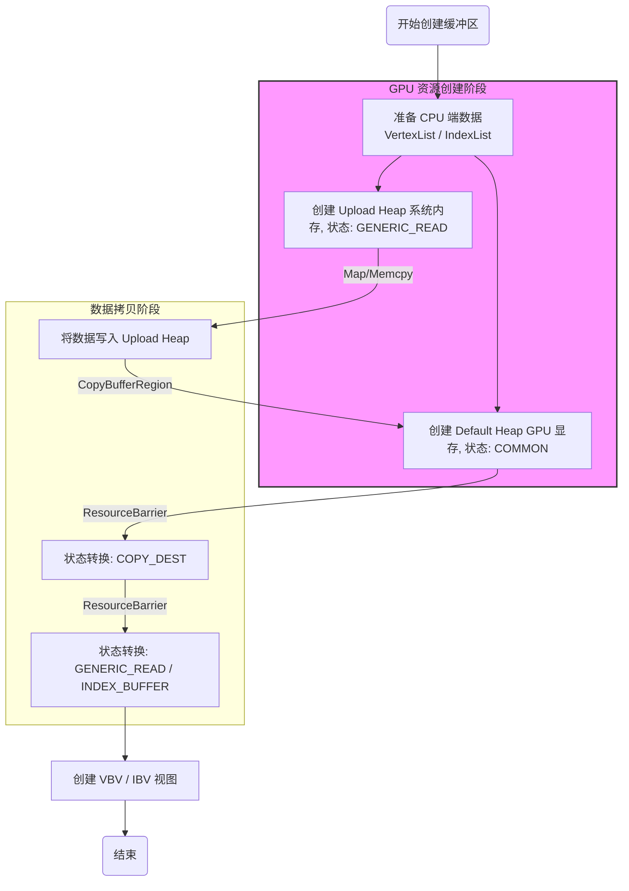
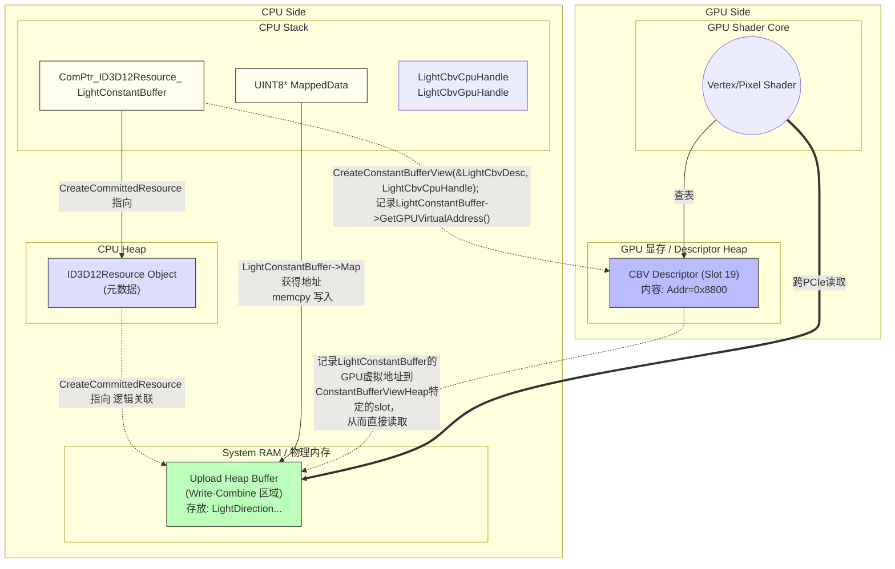

## dx12渲染器记录
目前进展
- 基础D3D12渲染管线：
  - 设备初始化
  - 命令队列/分配器/列表
  - 交换链 (双缓冲)
  - 渲染目标视图 (RTV)
  - 深度模板缓冲 (DSV) - 支持深度测试
  - 视口与裁剪矩形
  - 围栏同步机制
- 着色器系统
  - 着色器管理器 (DXShader / DXShaderManager)
    - 着色器缓冲
    - 运行时编译
  - 根签名封装
  - PSO管理器
- 几何体系统
- 材质系统
- 相机系统
- 常量缓冲区

当前流程
InitDX() 初始化
  - 创建设备/命令队列
  - 创建交换链
  - 创建RTV/DSV
  - 编译着色器
  - 创建PSO
  - 创建常量缓冲区
  - 初始化几何体

Draw() 主循环
- 重置命令列表
- 更新常量缓冲区 (MVP矩阵)
- 设置描述符堆
- 清理RTV/DSV
- 设置根签名
- 遍历MeshList绘制
- Present呈现
- 同步等待GPU

# 2025-11-08 下一阶段的目标是：
统一几何体系统：
目前的几何体系统准备都基于Mesh去做


结尾：StandardVertexInputLayout还没定义，准备修改Vertex

# 2025-12-04 
StandardVertexInputLayout定义+StandardVertex
结尾：
当前位置 ─────────────────────────────────────────────────────────►

[几何体系统] → [基础光照] → [纹理系统] → [PBR材质] → [阴影] → [GAMES202]
   1-2天         2-3天        3-4天       3-4天      1-2周     每个1-2周
添加更多基础几何体

# 2025-12-06
完善了 Geometry.h Geometry.cpp的sphere和panel几何体，添加到了目前的流程里面。

后面该做什么？



# 2025-12-13

添加了lightConstantbuffer 和法线信息
- 如何添加一个Constantbuffer？
Render类添加了成员变量：
```
	Microsoft::WRL::ComPtr<ID3D12Resource> LightConstantBuffer;
	UINT8* LightConstantBufferMappedData = nullptr;
	D3D12_CPU_DESCRIPTOR_HANDLE LightCbvCpuHandle;
	D3D12_GPU_DESCRIPTOR_HANDLE LightCbvGpuHandle;
	LightConstants LightConstantInstance;
```
ComPtr 还是当作windows的智能指针理解
ID3D12Resource 位于CPU侧RAM的堆中 存储gpu资源的地址和信息

CreateConstantBufferView初始化函数新增部分
```
	// Light Constant Buffer
	const UINT LightConstantBufferSize = (sizeof(LightConstants) + 255) & ~255;

    // 创建上传堆的常量缓冲资源
    CD3DX12_HEAP_PROPERTIES LightHeapProps = CD3DX12_HEAP_PROPERTIES(D3D12_HEAP_TYPE_UPLOAD);
    CD3DX12_RESOURCE_DESC BufferDesc = CD3DX12_RESOURCE_DESC::Buffer(LightConstantBufferSize);
    ThrowIfFailed(Device::GetInstance().GetD3DDevice()->CreateCommittedResource(&LightHeapProps, D3D12_HEAP_FLAG_NONE, &BufferDesc,
        D3D12_RESOURCE_STATE_GENERIC_READ,
        nullptr,
	   IID_PPV_ARGS(&LightConstantBuffer)));
    // 2) 映射得到 CPU 可写指针
    CD3DX12_RANGE ReadRange(0, 0);
    ThrowIfFailed(LightConstantBuffer->Map(0, &ReadRange, reinterpret_cast<void**>(&LightConstantBufferMappedData)));
	LightCbvCpuHandle = ConstantBufferViewHeap->GetCPUDescriptorHandleForHeapStart();
    LightCbvCpuHandle.ptr += /* LightCbvHeapIndex */ 19 * SrvUavDescriptorSize;
    LightCbvGpuHandle = ConstantBufferViewHeap->GetGPUDescriptorHandleForHeapStart();
    LightCbvGpuHandle.ptr += /* LightCbvHeapIndex */ 19 * SrvUavDescriptorSize;
    // 创建 CBV 
    D3D12_CONSTANT_BUFFER_VIEW_DESC LightCbvDesc = {};
    LightCbvDesc.BufferLocation = LightConstantBuffer->GetGPUVirtualAddress();
    LightCbvDesc.SizeInBytes = LightConstantBufferSize;
	Device::GetInstance().GetD3DDevice()->CreateConstantBufferView(&LightCbvDesc, LightCbvCpuHandle);
```
upload类型，会让heap资源创建在cpu侧，gpu通过PCIe读取
如果是default类型，会直接创建在gpu的vram上
``LightConstantBuffer->Map(0, &ReadRange, reinterpret_cast<void**>(&LightConstantBufferMappedData))``  ReadRange(0, 0)表示只写不读，LightConstantBufferMappedData是UINT8*指针，目的是拿到heap的位置，这样后续可以直接memcpy到upload heap buffer操作数据。
``CreateConstantBufferView``就是把gpu的heapDescripter的表的相应的slot填入UploadHeapBuffer的信息，包括地址和长度。首先需要先获取slot的位置：```LightCbvCpuHandle = ConstantBufferViewHeap->GetCPUDescriptorHandleForHeapStart();
    LightCbvCpuHandle.ptr += LightCbvHeapIndex ```
然后调用CreateConstantBufferView，在相应的位置填上` {LightConstantBuffer->GetGPUVirtualAddress(),LightConstantBufferSize}`




还是需要一个好一点的画图工具..

明日计划：


# 2025-12-21
阴影实现
明天再写总结和计划。。

# 2026
总结什么的已经忘了，但可以更新一下work记录
- 经典阴影-PCF-PCSS


- PBR IBL

- 自动转换


# 暂时写下目前的几个类的构建流程吧
MeshBase:
私有成员：
- XMFLOAT3 Pos，Angle，Scale 定义物体的transform
- std::vector<StandardVertex> VertexList 定义物体的顶点列表
- std::vector<std::uint16_t> IndiceList; 定义三角形列表
- VertexList IndiceList 对应的CPU GPU Buffer
- ObjectConstantBuffer：传入MVP矩阵的，以及对应的ConstantBufferMappedData
- 对应的材质指针

方法：InitVertexBufferAndIndexBuffer:
- 填充VertexList 和 IndiceList
- CreateVertexAndIndexBufferHeap
  - VertexList
    - ID3DBlob CPU副本 （暂时没用上）
    - 创建 Default Heap VertexDefaultBufferGPU
    - 创建 Upload Heap `CreateCommittedResource(...IID_PPV_ARGS(&VertexUploadBuffer))`
    - DefaultBuffer 切换成copy状态
    - `CommandList->CopyBufferRegion(...) upload->default`
    - Default 转换为VERTEX_AND_CONSTANT_BUFFER
  - IndiceList同理
    - 转换为D3D12_RESOURCE_STATE_INDEX_BUFFER
派生类Box，Plane，Sphere 主要区别在于VertexList的填充方式

- 那这样如何绑定给IA？
- ```            CommandList->IASetPrimitiveTopology(D3D_PRIMITIVE_TOPOLOGY_TRIANGLELIST);
            auto VertexBufferView = MeshElement->GetVertexBufferView();
            CommandList->IASetVertexBuffers(0, 1, &VertexBufferView);
            auto IndexBufferView = MeshElement->GetIndexBufferView();
            CommandList->IASetIndexBuffer(&IndexBufferView);

            CommandList->DrawIndexedInstanced(MeshElement->GetIndexCount(), 1, 0, 0, 0);
            ```
- 总结来说，每个Mesh维护自己的顶点数据和索引数据，在初始化的时候就把cpu的UploadBuffer和GPU上的buffer创建好，把顶点和索引copy到UploadBuffer buffer，然后 copy到gpu的buffer，保存VertexBufferView 和ibv，到IA阶段传vbv和ibv绑定


Material：
之前写的非常非常混乱的一个类...之前把pso material rootsignature绑在一起
现在将其重构了，目前Material类成员变量

    std::string Name;
	MaterialConstants ConstantData;

	//texture
	std::shared_ptr<Texture> AlbedoTexture;
	std::shared_ptr<Texture> NormalTexture;
	std::shared_ptr<Texture> MetallicTexture;


纯数据容器
MaterialManager：管理material类
维护一个`unordered_map<std::string, std::shared_ptr<Material>> Materials`
创建了material后添加到这里面

	auto TestMaterial = std::make_shared<Material>("TestMaterial");
	MaterialManager::GetInstance().AddMaterial(TestMaterial);

到时候绑定的时候：

    Material* MaterialPtr = MaterialManager::GetInstance().GetMaterialByName(MaterialName);
    memcpy(CurrFrameResource.MaterialConstantBufferMappedData + i * MatConstantBufferSize, &MaterialPtr->GetConstantData(), sizeof(matConstants));
    CommandList->SetGraphicsRootConstantBufferView(2, CurrFrameResource.MaterialConstantBuffer->GetGPUVirtualAddress() + i * MatConstantBufferSize);
    if (MaterialPtr->HasAlbedoTexture())
    {
        MaterialPtr->GetAlbedoTexture()->BindSRV_Graphics(CommandList, 8);
    }
    ...

这样就需要把MaterialConstants作为根签名的跟参数（原本是整合到跟参数表Descriptor Table的，现在又拿出来了）

好，那讲到这里有用两个新东西。CurrFrameResource是什么？
（龙书第多少章来着）

    struct FrameResource
    {
        ComPtr<ID3D12CommandAllocator> CmdAllocator;
        UINT64 FenceValue = 0;

        //LightCB
        ComPtr<ID3D12Resource> LightConstantBuffer;
        UINT8* LightConstantBufferMappedData = nullptr;

        //ObjectCB
        ComPtr<ID3D12Resource> ObjectConstantBuffer;
        UINT8* ObjectConstantBufferMappedData = nullptr;

        //MaterialCB
        ComPtr<ID3D12Resource> MaterialConstantBuffer;
        UINT8* MaterialConstantBufferMappedData = nullptr;

        void Init(ID3D12Device* device, UINT maxObjectCount);

    };
我们给每帧都定义了帧资源。每帧管理了几块内存，在cpu运行的时候记录，提交，然后GPU跑，然后CPU继续异步做下一帧的命令提交，以最大化效率。

    FrameResource[0].ObjectCB  →  [obj0 | obj1 | obj2 | ...]  256字节对齐
    FrameResource[1].ObjectCB  →  [obj0 | obj1 | obj2 | ...]
    FrameResource[2].ObjectCB  →  [obj0 | obj1 | obj2 | ...]

那你的PSO RootSignature怎么办？
目前是每个Pass单独维护一个PSO，然后根签名是全局一个

    ShadowPass.Name = "ShadowPass";
	ShadowPass.PSO = GraphicsPSOBuilder(RootSignature.Get()).SetDepthOnly(DXGI_FORMAT_D24_UNORM_S8_UINT).Build(device);

..在这之前是不是还得讲讲Pass结构体。
PBR实现：
todo:

IBL实现：
todo:


