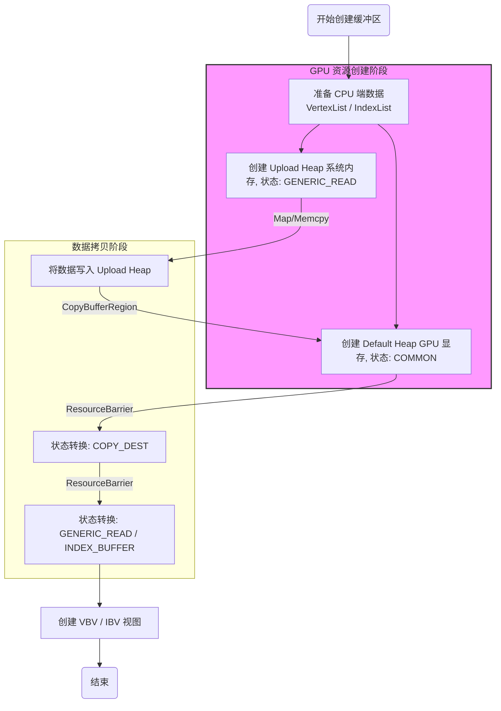
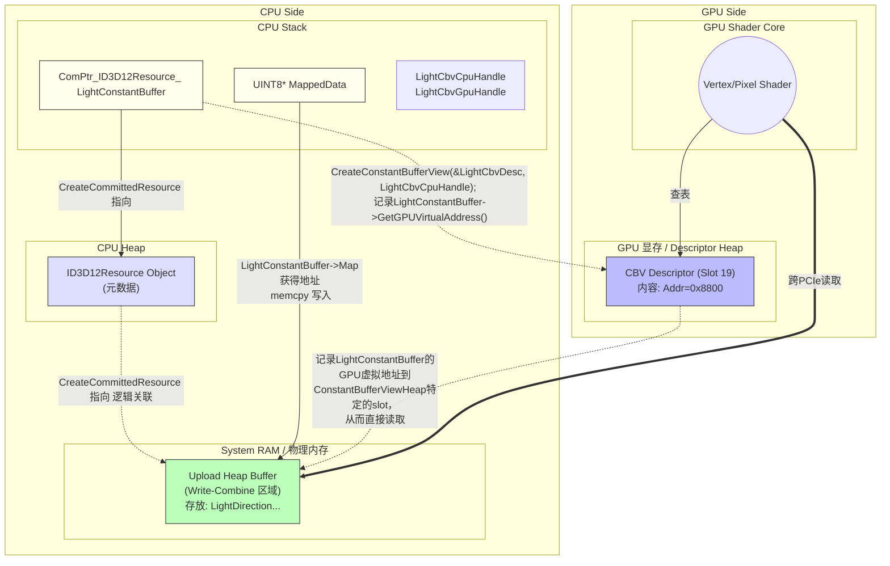

## dx12渲染器记录
目前进展
- 基础D3D12渲染管线：
  - 设备初始化
  - 命令队列/分配器/列表
  - 交换链 (双缓冲)
  - 渲染目标视图 (RTV)
  - 深度模板缓冲 (DSV) - 支持深度测试
  - 视口与裁剪矩形
  - 围栏同步机制
- 着色器系统
  - 着色器管理器 (DXShader / DXShaderManager)
    - 着色器缓冲
    - 运行时编译
  - 根签名封装
  - PSO管理器
- 几何体系统
- 材质系统
- 相机系统
- 常量缓冲区

当前流程
InitDX() 初始化
  - 创建设备/命令队列
  - 创建交换链
  - 创建RTV/DSV
  - 编译着色器
  - 创建PSO
  - 创建常量缓冲区
  - 初始化几何体

Draw() 主循环
- 重置命令列表
- 更新常量缓冲区 (MVP矩阵)
- 设置描述符堆
- 清理RTV/DSV
- 设置根签名
- 遍历MeshList绘制
- Present呈现
- 同步等待GPU

# 2025-11-08 下一阶段的目标是：
统一几何体系统：
目前的几何体系统准备都基于Mesh去做


结尾：StandardVertexInputLayout还没定义，准备修改Vertex

# 2025-12-04 
StandardVertexInputLayout定义+StandardVertex
结尾：
当前位置 ─────────────────────────────────────────────────────────►

[几何体系统] → [基础光照] → [纹理系统] → [PBR材质] → [阴影] → [GAMES202]
   1-2天         2-3天        3-4天       3-4天      1-2周     每个1-2周
添加更多基础几何体

# 2025-12-06
完善了 Geometry.h Geometry.cpp的sphere和panel几何体，添加到了目前的流程里面。

后面该做什么？


```mermaid
graph TD
    Start(开始创建缓冲区) --> A[准备 CPU 端数据\nVertexList / IndexList]
    
    subgraph GPU_Resource_Creation [GPU 资源创建阶段]
        A --> B[创建 Default Heap GPU 显存, 状态: COMMON ]
        A --> C[创建 Upload Heap 系统内存, 状态: GENERIC_READ ]
    end
    
    subgraph Data_Copy [数据拷贝阶段]
        C --Map/Memcpy--> D[将数据写入 Upload Heap]
        B --ResourceBarrier--> E[状态转换: COPY_DEST]
        D --CopyBufferRegion--> B
        E --ResourceBarrier--> F[状态转换: GENERIC_READ / INDEX_BUFFER]
    end
    
    F --> G[创建 VBV / IBV 视图]
    G --> End(结束)

    style GPU_Resource_Creation fill:#f9f,stroke:#333,stroke-width:2px

```

# 2025-12-13

添加了lightConstantbuffer 和法线信息
- 如何添加一个Constantbuffer？
Render类添加了成员变量：
```
	Microsoft::WRL::ComPtr<ID3D12Resource> LightConstantBuffer;
	UINT8* LightConstantBufferMappedData = nullptr;
	D3D12_CPU_DESCRIPTOR_HANDLE LightCbvCpuHandle;
	D3D12_GPU_DESCRIPTOR_HANDLE LightCbvGpuHandle;
	LightConstants LightConstantInstance;
```
ComPtr 还是当作windows的智能指针理解
ID3D12Resource 位于CPU侧RAM的堆中 存储gpu资源的地址和信息

CreateConstantBufferView初始化函数新增部分
```
	// Light Constant Buffer
	const UINT LightConstantBufferSize = (sizeof(LightConstants) + 255) & ~255;

    // 创建上传堆的常量缓冲资源
    CD3DX12_HEAP_PROPERTIES LightHeapProps = CD3DX12_HEAP_PROPERTIES(D3D12_HEAP_TYPE_UPLOAD);
    CD3DX12_RESOURCE_DESC BufferDesc = CD3DX12_RESOURCE_DESC::Buffer(LightConstantBufferSize);
    ThrowIfFailed(Device::GetInstance().GetD3DDevice()->CreateCommittedResource(&LightHeapProps, D3D12_HEAP_FLAG_NONE, &BufferDesc,
        D3D12_RESOURCE_STATE_GENERIC_READ,
        nullptr,
	   IID_PPV_ARGS(&LightConstantBuffer)));
    // 2) 映射得到 CPU 可写指针
    CD3DX12_RANGE ReadRange(0, 0);
    ThrowIfFailed(LightConstantBuffer->Map(0, &ReadRange, reinterpret_cast<void**>(&LightConstantBufferMappedData)));
	LightCbvCpuHandle = ConstantBufferViewHeap->GetCPUDescriptorHandleForHeapStart();
    LightCbvCpuHandle.ptr += /* LightCbvHeapIndex */ 19 * SrvUavDescriptorSize;
    LightCbvGpuHandle = ConstantBufferViewHeap->GetGPUDescriptorHandleForHeapStart();
    LightCbvGpuHandle.ptr += /* LightCbvHeapIndex */ 19 * SrvUavDescriptorSize;
    // 创建 CBV 
    D3D12_CONSTANT_BUFFER_VIEW_DESC LightCbvDesc = {};
    LightCbvDesc.BufferLocation = LightConstantBuffer->GetGPUVirtualAddress();
    LightCbvDesc.SizeInBytes = LightConstantBufferSize;
	Device::GetInstance().GetD3DDevice()->CreateConstantBufferView(&LightCbvDesc, LightCbvCpuHandle);
```
upload类型，会让heap资源创建在cpu侧，gpu通过PCIe读取
如果是default类型，会直接创建在gpu的vram上
``LightConstantBuffer->Map(0, &ReadRange, reinterpret_cast<void**>(&LightConstantBufferMappedData))``  ReadRange(0, 0)表示只写不读，LightConstantBufferMappedData是UINT8*指针，目的是拿到heap的位置，这样后续可以直接memcpy到upload heap buffer操作数据。
``CreateConstantBufferView``就是把gpu的heapDescripter的表的相应的slot填入UploadHeapBuffer的信息，包括地址和长度。首先需要先获取slot的位置：```LightCbvCpuHandle = ConstantBufferViewHeap->GetCPUDescriptorHandleForHeapStart();
    LightCbvCpuHandle.ptr += LightCbvHeapIndex ```
然后调用CreateConstantBufferView，在相应的位置填上` {LightConstantBuffer->GetGPUVirtualAddress(),LightConstantBufferSize}`



```mermaid
graph TD
    subgraph CPU_Side [CPU Side]
        direction TB
        
        subgraph CPU_Stack [CPU Stack]
            Var_ComPtr["ComPtr_ID3D12Resource_ LightConstantBuffer"]
            Var_MappedPtr[UINT8* MappedData]
            Var_LightHandle["LightCbvCpuHandle<br/>LightCbvGpuHandle"]
        end

        subgraph CPU_Heap [CPU Heap]
            Obj_Resource["ID3D12Resource Object<br/>(元数据)"]
        end

        subgraph System_RAM [System RAM / 物理内存]
            %% 加上引号防止解析错误
            Mem_Upload["Upload Heap Buffer<br/>(Write-Combine 区域)<br/>存放: LightDirection..."]
        end
    end

    %% =======================
    %% 右侧：GPU 环境
    %% =======================
    subgraph GPU_Side [GPU Side]
        direction TB
        
        subgraph GPU_VRAM [GPU 显存 / Descriptor Heap]
            Slot_Desc["CBV Descriptor (Slot 19)<br/>内容: Addr=0x8800"]
        end

        subgraph GPU_Core [GPU Shader Core]
            Shader_Unit(("Vertex/Pixel Shader"))
        end
    end

    %% =======================
    %% 连线关系
    %% =======================
    
    %% --- CPU 内部逻辑 ---
    Var_ComPtr -- "CreateCommittedResource 指向" --> Obj_Resource
    Obj_Resource -. "CreateCommittedResource 指向 逻辑关联" .-> Mem_Upload
    Var_MappedPtr -- "LightConstantBuffer->Map获得地址<br/> memcpy 写入" --> Mem_Upload


    %% 描述符(在GPU) 指向 内存(在CPU)
    Slot_Desc -. "记录LightConstantBuffer的GPU虚拟地址到ConstantBufferViewHeap特定的slot，<br/>从而直接读取" .-> Mem_Upload

    Var_ComPtr -."CreateConstantBufferView(&LightCbvDesc, LightCbvCpuHandle); <br/>记录LightConstantBuffer->GetGPUVirtualAddress() ".->Slot_Desc


    %% Shader(在GPU) 读取 内存(在CPU)
    Shader_Unit == "跨PCIe读取" ==> Mem_Upload

    Shader_Unit -- "查表" --> Slot_Desc

    %% --- 样式 ---
    style Var_ComPtr fill:#ffe,stroke:#333
    style Var_MappedPtr fill:#ffe,stroke:#333
    style Obj_Resource fill:#ddf,stroke:#333
    style Mem_Upload fill:#bfb,stroke:#333
    style Slot_Desc fill:#bbf,stroke:#333
```

还是需要一个好一点的画图工具..

明日计划：


```mermaid
graph TD;
    A-->B;
```

# 2025-12-21
阴影实现
明天再写总结和计划。。

# 2026
总结什么的已经忘了，但可以更新一下work记录
- 经典阴影-PCF-PCSS


- PBR IBL

- 自动转换


# 暂时写下目前的几个类的构建流程吧
MeshBase:
私有成员：
- XMFLOAT3 Pos，Angle，Scale 定义物体的transform
- std::vector<StandardVertex> VertexList 定义物体的顶点列表
- std::vector<std::uint16_t> IndiceList; 定义三角形列表
- VertexList IndiceList 对应的CPU GPU Buffer
- ObjectConstantBuffer：传入MVP矩阵的，以及对应的ConstantBufferMappedData
- 对应的材质指针

方法：InitVertexBufferAndIndexBuffer:
- 填充VertexList 和 IndiceList
- CreateVertexAndIndexBufferHeap
  - VertexList
    - ID3DBlob CPU副本 （暂时没用上）
    - 创建 Default Heap VertexDefaultBufferGPU
    - 创建 Upload Heap `CreateCommittedResource(...IID_PPV_ARGS(&VertexUploadBuffer))`
    - DefaultBuffer 切换成copy状态
    - `CommandList->CopyBufferRegion(...) upload->default`
    - Default 转换为VERTEX_AND_CONSTANT_BUFFER
  - IndiceList同理
    - 转换为D3D12_RESOURCE_STATE_INDEX_BUFFER
派生类Box，Plane，Sphere 主要区别在于VertexList的填充方式

- 那这样如何绑定给IA？
- ```            CommandList->IASetPrimitiveTopology(D3D_PRIMITIVE_TOPOLOGY_TRIANGLELIST);
            auto VertexBufferView = MeshElement->GetVertexBufferView();
            CommandList->IASetVertexBuffers(0, 1, &VertexBufferView);
            auto IndexBufferView = MeshElement->GetIndexBufferView();
            CommandList->IASetIndexBuffer(&IndexBufferView);

            CommandList->DrawIndexedInstanced(MeshElement->GetIndexCount(), 1, 0, 0, 0);
            ```
- 总结来说，每个Mesh维护自己的顶点数据和索引数据，在初始化的时候就把cpu的UploadBuffer和GPU上的buffer创建好，把顶点和索引copy到UploadBuffer buffer，然后 copy到gpu的buffer，保存VertexBufferView 和ibv，到IA阶段传vbv和ibv绑定


Material：
之前写的非常非常混乱的一个类...之前把pso material rootsignature绑在一起
现在将其重构了，目前Material类成员变量

    std::string Name;
	MaterialConstants ConstantData;

	//texture
	std::shared_ptr<Texture> AlbedoTexture;
	std::shared_ptr<Texture> NormalTexture;
	std::shared_ptr<Texture> MetallicTexture;


纯数据容器
MaterialManager：管理material类
维护一个`unordered_map<std::string, std::shared_ptr<Material>> Materials`
创建了material后添加到这里面

	auto TestMaterial = std::make_shared<Material>("TestMaterial");
	MaterialManager::GetInstance().AddMaterial(TestMaterial);

到时候绑定的时候：

    Material* MaterialPtr = MaterialManager::GetInstance().GetMaterialByName(MaterialName);
    memcpy(CurrFrameResource.MaterialConstantBufferMappedData + i * MatConstantBufferSize, &MaterialPtr->GetConstantData(), sizeof(matConstants));
    CommandList->SetGraphicsRootConstantBufferView(2, CurrFrameResource.MaterialConstantBuffer->GetGPUVirtualAddress() + i * MatConstantBufferSize);
    if (MaterialPtr->HasAlbedoTexture())
    {
        MaterialPtr->GetAlbedoTexture()->BindSRV_Graphics(CommandList, 8);
    }
    ...

这样就需要把MaterialConstants作为根签名的跟参数（原本是整合到跟参数表Descriptor Table的，现在又拿出来了）

好，那讲到这里有用两个新东西。CurrFrameResource是什么？
（龙书第多少章来着）

    struct FrameResource
    {
        ComPtr<ID3D12CommandAllocator> CmdAllocator;
        UINT64 FenceValue = 0;

        //LightCB
        ComPtr<ID3D12Resource> LightConstantBuffer;
        UINT8* LightConstantBufferMappedData = nullptr;

        //ObjectCB
        ComPtr<ID3D12Resource> ObjectConstantBuffer;
        UINT8* ObjectConstantBufferMappedData = nullptr;

        //MaterialCB
        ComPtr<ID3D12Resource> MaterialConstantBuffer;
        UINT8* MaterialConstantBufferMappedData = nullptr;

        void Init(ID3D12Device* device, UINT maxObjectCount);

    };
我们给每帧都定义了帧资源。每帧管理了几块内存，在cpu运行的时候记录，提交，然后GPU跑，然后CPU继续异步做下一帧的命令提交，以最大化效率。

    FrameResource[0].ObjectCB  →  [obj0 | obj1 | obj2 | ...]  256字节对齐
    FrameResource[1].ObjectCB  →  [obj0 | obj1 | obj2 | ...]
    FrameResource[2].ObjectCB  →  [obj0 | obj1 | obj2 | ...]

那你的PSO RootSignature怎么办？
目前是每个Pass单独维护一个PSO，然后根签名是全局一个

    ShadowPass.Name = "ShadowPass";
	ShadowPass.PSO = GraphicsPSOBuilder(RootSignature.Get()).SetDepthOnly(DXGI_FORMAT_D24_UNORM_S8_UINT).Build(device);

..在这之前是不是还得讲讲Pass结构体。
PBR实现：
todo:

IBL实现：
todo:


radiance cascade


radiance cascade2


---

## 我们的实现

### 文件结构

| 文件 | 作用 |
|------|------|
| `GI_VoxelBuild.hlsl` | Compute Shader，生成 32×32×48 体素网格 (RWTexture3D)。`Scene_RCSample()` 翻译自 bufferB |
| `GI_Cascade.hlsl` | **统一** Cascade 构建 (CS, level 0-4)。trace ray → 直接光 + 读 preFrameCascade0 间接光 → merge 上级 → 写入 currCascade |
| `GI_View.hlsl` | 视图渲染 (VS+PS, 全屏三角形)。DDA 穿体素 → 读 cascade0 间接光 + 直接光 + shadow ray → 色调映射 |
| `render.cpp` | Pass 调度、RootConstants、调试相机键盘输入 |
| `RenderPasses/RenderPasses.cpp` | PSO/RootSig 创建。`GI_VoxelBuildPass` → `GI_CascadePass`(×5级) → `GI_ViewPass` |
| `GI_Cascade0.hlsl` | **已废弃**（原始 cascade0 专用 shader，已被 GI_Cascade.hlsl 统一替代） |

### 数据流

```
Frame N:
  1. GI_VoxelBuildPass    → voxelGrid (RWTexture3D, 32×32×48)
  2. GI_CascadePass lv=0  → cascade0 (StructuredBuffer, 32×32×48×54 floats)
     读 voxelGrid + preFrameCascade0(上一帧)
  3. GI_CascadePass lv=1  → cascade1, 读 voxelGrid + cascade0(upper) + preFrameCascade0
  4. GI_CascadePass lv=2  → cascade2, 读 voxelGrid + cascade1(upper) + preFrameCascade0
  5. GI_CascadePass lv=3  → cascade3, 读 voxelGrid + cascade2(upper) + preFrameCascade0
  6. GI_CascadePass lv=4  → cascade4, 读 voxelGrid + cascade3(upper) + preFrameCascade0
  7. GI_ViewPass          → back buffer, 读 voxelGrid + cascade0~4 + DebugCB
```

### Cascade 级数参数

| Level | 空间分辨率 | probeSize | raysPerHemi | Buffer 大小 |
|-------|-----------|-----------|-------------|------------|
| 0 | 32×32×48 | 3 | 9 | 32×32×48×54 = 2,654,208 |
| 1 | 16×16×24 | 6 | 36 | 16×16×24×216 = 1,327,104 |
| 2 | 8×8×12 | 12 | 144 | 8×8×12×864 = 663,552 |
| 3 | 4×4×6 | 24 | 576 | 4×4×6×3456 = 331,776 |
| 4 | 2×2×3 | 48 | 2304 | 2×2×3×13824 = 165,888 |

### 半球 (Hemi) 约定

```
0: -X   1: +X   2: -Y   3: +Y   4: -Z   5: +Z
```

每个体素存储 6 个半球 × N 根 ray 的 radiance。索引公式：
```
index = voxelId × (6 × raysPerHemi) + hemi × raysPerHemi + ray
voxelId = x + y × resX + z × resX × resY
```

### 关键差异 vs 参考

| 项目 | 参考 | 我们 |
|------|------|------|
| **加权** | 存储时加权 (ComputeWeight)，读时直接加 | 读时 CASC0_WEIGHT 积分，存储时无权重 |
| **DFBox** | `abs(p) - b`（b=半边长） | `abs(p - b*0.5) - b*0.5`（b=全长）⚠️ |
| **直接光阴影** | 预计算 Shadow Map + PCF 采样 | 内联 shadow ray (DDA 64 步) |
| **太阳** | `GetSunDir(t)` 随时间旋转 | 硬编码 `normalize(0.5, 1.0, -0.3)` |
| **Merge** | `distInterp = clamp((dist - lodFactor) / lodFactor * 0.5, 0, 1)` 且 ×1.0 | 同参考公式 |
| **Cascade0 间接** | 读上一帧 cascade0（帧间累积） | 同，`preFrameCascade0` (t2) |
| **色调映射** | 无（直接输出） | `color / (color+1)` + gamma 2.2 |

### CASC0_WEIGHT（读时积分权重）

专门为 cascade 0 (probeSize=3, 9 rays) 设计，已将 Lambert 的 `/PI` 纳入：
```
     0.0625  0.0625  0.0625
     0.0625  0.5     0.0625
     0.0625  0.0625  0.0625
```
总和精确为 1.0（能量守恒）。

### Debug 相机

- W/S: 前进/后退
- A/D: 左移/右移  
- Q/E: 下降/上升
- 方向键: 旋转
- RootConstants (b1): `uint cascadeLevel, float yaw, pitch, posX, posY, posZ` (6 DWORDs)

### VIZ_MODE

| 值 | 模式 |
|----|------|
| 0 | 完整 GI (albedo × (indirect + direct)) |
| 1 | 体素 albedo + N·L (调试 voxel build + DDA) |
| 2 | 法线可视化 |

---

## 已知问题 / TODO

1. **DFBox 约定不一致**：我们的 DFBox 使用 `abs(p - b*0.5) - b*0.5`（b=全长），参考使用 `abs(p) - b`（b=半长）。调用点的语义不同但碰巧大部分场景通过了。如果要完全对齐参考需要统一。
2. **布料几何简化**：原始布料太薄（1 体素宽），32³ 下产生空隙。已加粗到 ±1.5 体素。
3. **无预计算 Shadow Map**：当前用内联 shadow ray，每 hit 多 trace 一根 64 步 DDA。后续可改为预计算 shadow map 降低开销。
4. **Merge ×1.5**：之前 merge 乘了 1.5 补偿暗度，需确认是否需要（直接光已加入后应该不需要）。
5. **帧间累积**：当前只用 preFrameCascade0（1 帧历史），可扩展为多帧 temporal accumulation。


npm run push


